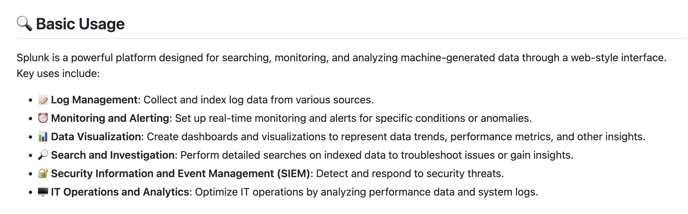
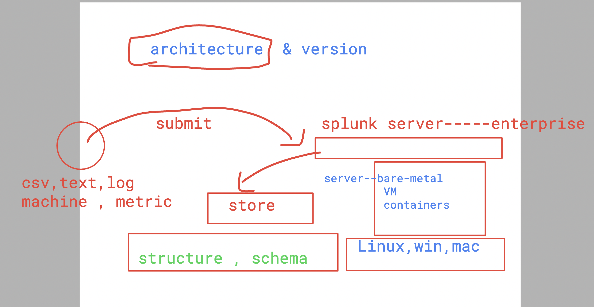
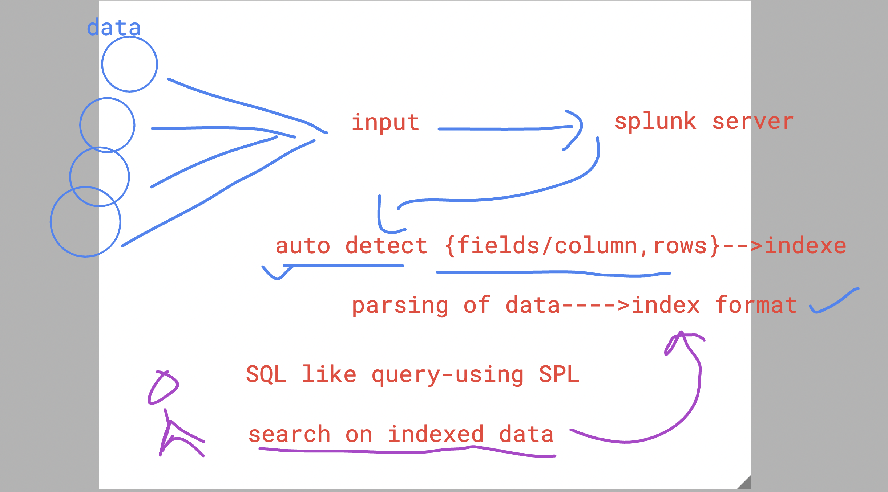

# JPMC-splunk_19thjune2024

## Basic info about Splunk 



### more info about splunk 



### splunk to data 



### indexer , search head , management console 


### setup as standalone server


## requirements for splunk installation

[click_here](https://docs.splunk.com/Documentation/Splunk/latest/Installation/Systemrequirements)

### Splunk in overall ways


### splunk version 9.x we are using 


## splunk Enterprise setup on linux -- redhat based OS 

### step 1 -- Download splunk enterprise software 


### SPlunk pacakge for linux distros


### Installing rpm package 

```
root@ip-172-31-56-141 ~]# ls
splunk-9.2.1-78803f08aabb.x86_64.rpm
[root@ip-172-31-56-141 ~]# 
[root@ip-172-31-56-141 ~]# rpm  -ivh  splunk-9.2.1-78803f08aabb.x86_64.rpm 
warning: splunk-9.2.1-78803f08aabb.x86_64.rpm: Header V4 RSA/SHA256 Signature, key ID b3cd4420: NOKEY
Preparing...                          ################################# [100%]
Updating / installing...
   1:splunk-9.2.1-78803f08aabb        ############################      ( 84%)

```

### verify installation 

```
rpm -qa  | grep splunk 
splunk-9.2.1-78803f08aabb.x86_64
[root@ip-172-31-56-141 ~]# 

```

## exploring splunk config files 

### bin directory 
- holding all splunk enterprise related binaries 

```
# cd  /opt/splunk/
[root@ip-172-31-56-141 splunk]# ls
bin    copyright.txt  ftr      lib               openssl  quarantined_files  share                                                swidtag
cmake  etc            include  license-eula.txt  opt      README-splunk.txt  splunk-9.2.1-78803f08aabb-linux-2.6-x86_64-manifest
[root@ip-172-31-56-141 splunk]# cd  bin/
[root@ip-172-31-56-141 bin]# pwd
/opt/splunk/bin
[root@ip-172-31-56-141 bin]# ls
2to3-3.7                    fill_summary_index.py   mongod                         priforgepng  rapidDiag                       splunk
bloom                       genAuditKeys.py         mongod-3.6                     prigreypng   recover-metadata                splunkd
bottle.py                   genRootCA.sh            mongod-4.0                     pripalpng    rest_handler.py                 splunkmon
btool                       genSignedServerCert.py  mongodump                      pripamtopng  runScript.py                    splunk-optimize
btprobe                     genSignedServerCert.sh  mongorestore                   pripnglsch   S3benchmark                     splunk-optimize-lex
bzip2                       genWebCert.py         
```

### splunk configuration files under etc 

```
root@ip-172-31-56-141 splunk]# ls
bin    copyright.txt  ftr      lib               openssl  quarantined_files  share                                                swidtag
cmake  etc            include  license-eula.txt  opt      README-splunk.txt  splunk-9.2.1-78803f08aabb-linux-2.6-x86_64-manifest
[root@ip-172-31-56-141 splunk]# cd  etc/
[root@ip-172-31-56-141 etc]# ls
anonymizer     deployment-apps  log-btool-debug.cfg    log-searchprocess.cfg  myinstall        searchLanguage.xml          splunk.version
apps           disabled-apps    log.cfg                log-utility.cfg        openldap         shcluster                   system
auth           findlogs.ini     log-cmdline.cfg        manager-apps           packages         splunk-enttrial.lic         users
copyright.txt  init.d           log-cmdline-debug.cfg  master-apps            packagetype      splunk-launch.conf
datetime.xml   log-btool.cfg    log-debug.cfg          modules                prettyprint.xsl  splunk-launch.conf.default
[root@ip-172-31-56-141 etc]# cat  splunk.version 
VERSION=9.2.1
BUILD=78803f08aabb
PRODUCT=splunk
PLATFORM=Linux-x86_64
[root@ip-172-31-56-141 etc]# cat  splunk-launch.conf
#   Version 9.2.1

# Modify the following line to suit the location of your Splunk install.
# If unset, Splunk will use the parent of the directory containing the splunk
# CLI executable.
#
```

### start splunk enterprise 

```

[root@ip-172-31-56-141 splunk]# /opt/splunk/bin/splunk  start  --accept-license 

This appears to be your first time running this version of Splunk.

Splunk software must create an administrator account during startup. Otherwise, you cannot log in.
Create credentials for the administrator account.
Characters do not appear on the screen when you type in credentials.

Please enter an administrator username: admin
Password must contain at least:
   * 8 total printable ASCII character(s).
Please enter a new password: 
Please confirm new password: 
Copying '/opt/splunk/etc/openldap/ldap.conf.default' to '/opt/splunk/etc/openldap/ldap.conf'.
Generating RSA private key, 2048 bit long modulus
..........+++++
.........................+++++
e is 65537 (0x10001)
writing RSA key

Generating RSA private key, 2048 bit long modulus
.................................................................................+++++
..........+++++
e is 65537 (0x10001)
writing RSA key

Moving '/opt/splunk/share/splunk/search_mrsparkle/modules.new' to '/opt/splunk/share/splunk/search_mrsparkle/modules'.

Splunk> Like an F-18, bro.

Checking prerequisites...
        Checking http port [8000]: open
        Checking mgmt port [8089]: open
        Checking appserver port [127.0.0.1:8065]: open
        Checking kvstore port [8191]: open
        Checking configuration... Done.
                Creating: /opt/splunk/var/lib/splunk
                Creating: /opt/splunk/var/run/splunk
                Creating: /opt/splunk/var/run/splunk/appserver/i18n
                Creating: /opt/splunk/var/run/splunk/appserver/modules/static/css
                Creating: /opt/splunk/var/run/splunk/upload
                Creating: /opt/splunk/var/run/splunk/search_telemetry
                Creating: /opt/splunk/var/run/splunk/search_log
                Creating: /opt/splunk/var/spool/splunk
                Creating: /opt/splunk/var/spool/dirmoncache
                Creating: /opt/splunk/var/lib/splunk/authDb
```

### few more commands to handle splunk servvice

```
/opt/splunk/bin/splunk  status
splunkd is running (PID: 7952).
splunk helpers are running (PIDs: 7956 8199 8245 8310 8608).
[root@ashu-server ~]# 
[root@ashu-server ~]# /opt/splunk/bin/splunk  stop
Stopping splunkd...
Shutting down.  Please wait, as this may take a few minutes.
..                                                         [  OK  ]
Stopping splunk helpers...
                                                           [  OK  ]
Done.
[root@ashu-server ~]# /opt/splunk/bin/splunk  start

Splunk> Like an F-18, bro.

Checking prerequisites...
        Checking http port [8000]: open
        Checking mgmt port [8089]: open
```

### enable auto start on boot of machine 

```
/opt/splunk/bin/splunk  stop 
====>>

/opt/splunk/bin/splunk  enable boot-start
Init script installed at /etc/init.d/splunk.
Init script is configured to run at boot.

```
