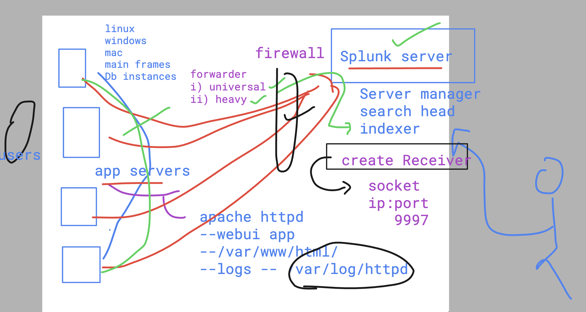
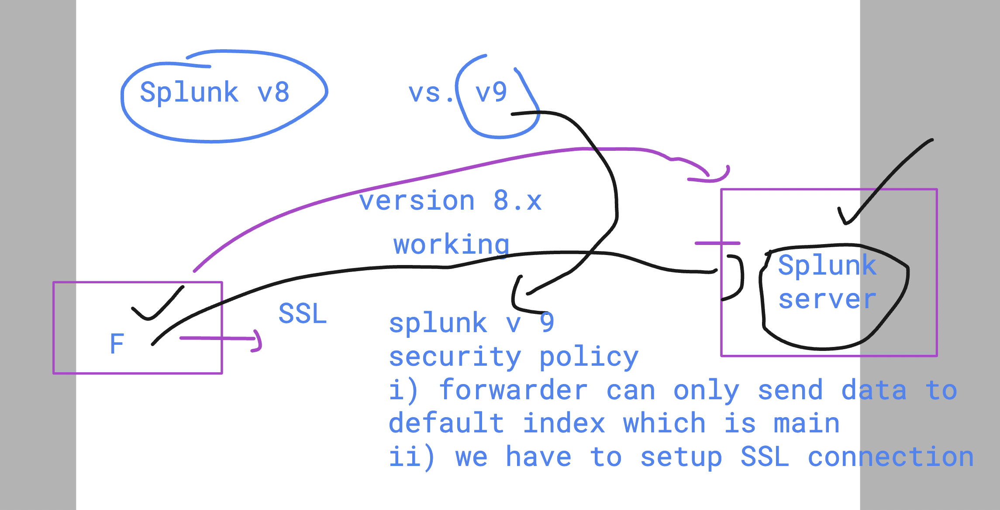
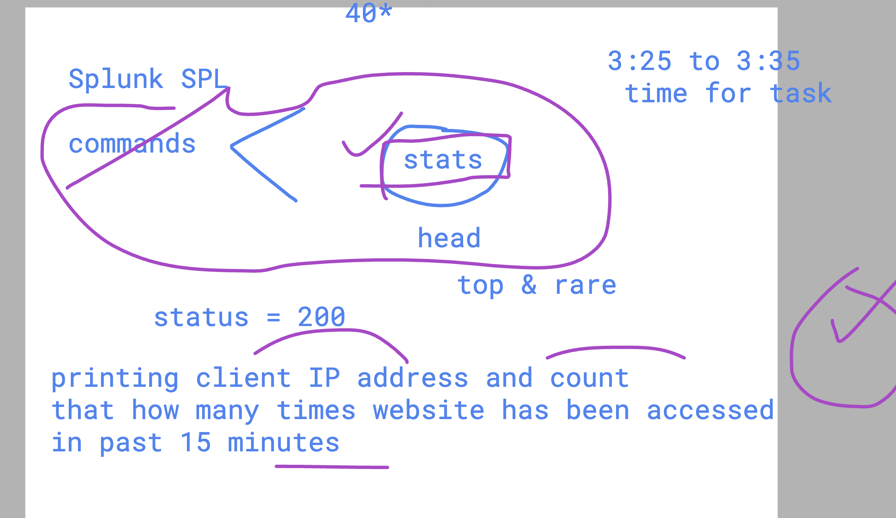
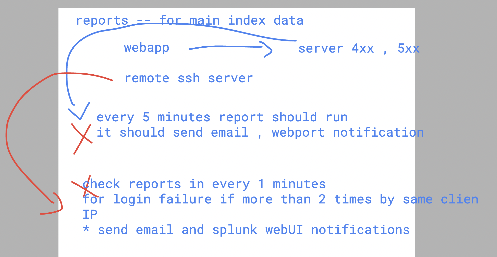
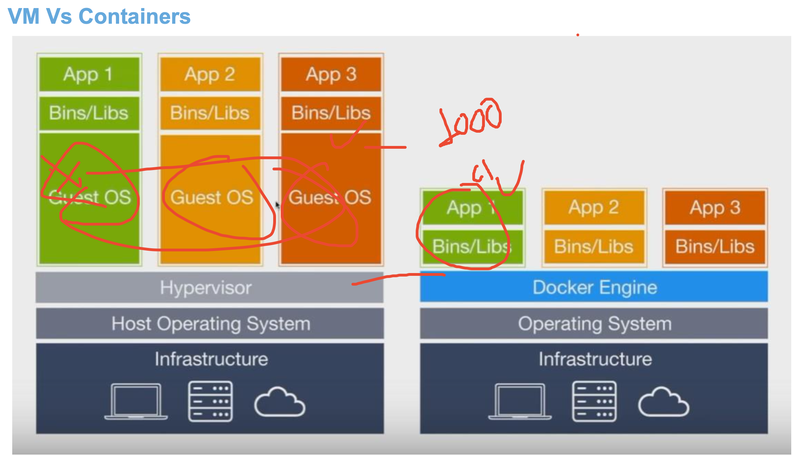

# JPMC-splunk_19thjune2024


### verify splunk server status

```
[root@jpmc-splunk-server ~]# /opt/splunk/bin/splunk status
splunkd is running (PID: 3388).
splunk helpers are running (PIDs: 3391 3635 3689 3764 7321 7322).
[root@jpmc-splunk-server ~]# 
[root@jpmc-splunk-server ~]# netstat -nlpt
Active Internet connections (only servers)
Proto Recv-Q Send-Q Local Address           Foreign Address         State       PID/Program name    
tcp        0      0 0.0.0.0:22              0.0.0.0:*               LISTEN      3255/sshd           
tcp        0      0 0.0.0.0:8089            0.0.0.0:*               LISTEN      3388/splunkd        
tcp        0      0 127.0.0.1:25            0.0.0.0:*               LISTEN      3194/master         
tcp        0      0 0.0.0.0:8191            0.0.0.0:*               LISTEN      3635/mongod         
tcp        0      0 0.0.0.0:8000            0.0.0.0:*               LISTEN      3388/splunkd       
```


### verify app server 

```
ec2-user@ip-172-31-85-58 ~]$ sudo -i
[root@ip-172-31-85-58 ~]# 
[root@ip-172-31-85-58 ~]# 
[root@ip-172-31-85-58 ~]# rpm -q httpd
httpd-2.4.59-2.amzn2023.x86_64
[root@ip-172-31-85-58 ~]# 
[root@ip-172-31-85-58 ~]# ls  /var/www/html/
LICENSE.txt  README.txt  assets  elements.html  generic.html  html-sample-app  html5up-phantom.zip  images  index.html
[root@ip-172-31-85-58 ~]# 
[root@ip-172-31-85-58 ~]# systemctl status httpd
● httpd.service - The Apache HTTP Server
     Loaded: loaded (/usr/lib/systemd/system/httpd.service; enabled; preset: disabled)
     Active: active (running) since Thu 2024-06-20 04:44:08 UTC; 36min ago
       Docs: man:httpd.service(8)
   Main PID: 1959 (httpd)
     Status: "Total requests: 7; Idle/Busy workers 100/0;Requests/sec: 0.00319; Bytes served/sec:   5 B/sec"
      Tasks: 177 (limit: 1114)
     Memory: 18.7M
        CPU: 1.277s
     CGroup: /system.slice/httpd.service
             ├─1959 /usr/sbin/httpd -DFOREGROUND
             ├─1965 /usr/sbin/httpd -DFOREGROUND
             ├─1966 /usr/sbin/httpd -DFOREGROUND
             ├─1967 /usr/sbin/httpd -DFOREGROUND
             └─1968 /usr/sbin/httpd -DFOREGROUND

Jun 20 04:44:07 ip-172-31-85-58.ec2.internal systemd[1]: Starting httpd.service - The Apache HTTP Server...
Jun 20 04:44:08 ip-172-31-85-58.ec2.internal systemd[1]: Started httpd.service - The Apache HTTP Server.
Jun 20 04:44:08 ip-172-31-85-58.ec2.internal httpd[1959]: Server configured, listening on: port 80
[root@ip-172-31-85-58 ~]# ls   /var/log/httpd/
access_log  error_log
```

### verify splunk universal forwarder 

```
root@ip-172-31-55-184 ~]# cd /opt/splunkforwarder/
[root@ip-172-31-55-184 splunkforwarder]# ls
bin    copyright.txt  include  license-eula.txt  README-splunk.txt  splunkforwarder-9.2.1-78803f08aabb-linux-2.6-x86_64-manifest  var
cmake  etc            lib      openssl           share              swidtag
[root@ip-172-31-55-184 splunkforwarder]# 
[root@ip-172-31-55-184 splunkforwarder]# /opt/splunkforwarder/bin/splunk start --accept-license ^C
[root@ip-172-31-55-184 splunkforwarder]# 
[root@ip-172-31-55-184 splunkforwarder]# /opt/splunkforwarder/bin/splunk  status
Warning: Attempting to revert the SPLUNK_HOME ownership
Warning: Executing "chown -R splunkfwd:splunkfwd /opt/splunkforwarder"
splunkd is running (PID: 3339).
splunk helpers are running (PIDs: 3409).
[root@ip-172-31-55-184 splunkforwarder]# 


```

## To accept data from forwarder on Splunk server 

- create on splunk enterprise server a receiver

### creating listner on splunk server 



### adding forwarer to splunk server as list 

```
/opt/splunkforwarder/bin/splunk add  forward-server 3.222.96.211:9997
```

## Introduction to SPL 

### using boolean operator in index 

```
index="ashu-web" OR index="ashu-secure"
```

## SPlunk v9 forwarder data to splunk server things 



### checking forwarder 

```
 cd /opt/splunkforwarder/etc/apps/
[root@ip-172-31-22-181 apps]# ls
SplunkUniversalForwarder  introspection_generator_addon  journald_input  learned  search  splunk_httpinput  splunk_internal_metrics
[root@ip-172-31-22-181 apps]# cd search/
[root@ip-172-31-22-181 search]# ls
default  local  metadata
[root@ip-172-31-22-181 search]# cd local/
[root@ip-172-31-22-181 local]# ls
inputs.conf
[root@ip-172-31-22-181 local]# 

```

### add monitor without index info 

```
/opt/splunkforwarder/bin/splunk add monitor  /var/log

===>>
/opt/splunkforwarder/bin/splunk  restart 
```


### more stats query 

```
index="main" host="ip-172-31-85-58.ec2.internal"  status=40*  | stats count by clientip
```

### top and rare in SPL 



### using where 

```
index="main" host="ip-172-31-85-58.ec2.internal" | rare limit=100 clientip | where count<3
```

## reports tasks 




## intro to docker and container for splunk 

- container is not having any particular OS or its library 



### installing docker on any linux server 

```
[root@ip-172-31-22-181 httpd]# yum install docker -y 
Failed to set locale, defaulting to C
Loaded plugins: extras_suggestions, langpacks, priorities, update-motd
Package docker-25.0.3-1.amzn2.0.1.x86_64 already installed and latest version
Nothing to do
[root@ip-172-31-22-181 httpd]# systemctl enable  --now docker 
[root@ip-172-31-22-181 httpd]# 
[root@ip-172-31-22-181 httpd]# docker version 
Client:
 Version:           25.0.3
 API version:       1.44
 Go version:        go1.20.12
 Git commit:        4debf41
 Built:             Wed Feb 28 00:29:45 2024
 OS/Arch:           linux/amd64
 Context:           default

Server:
 Engine:
  Version:          25.0.3
  API version:      1.44 (minimum version 1.24)
  Go version:       go1.20.12


```

### deploy splunk enterprise server using docker

```
docker run -d -p 8000:8000 -e "SPLUNK_START_ARGS=--accept-license"  -e "SPLUNK_PASSWORD=redhat@098" --name splunk splunk/splunk:latest

```


