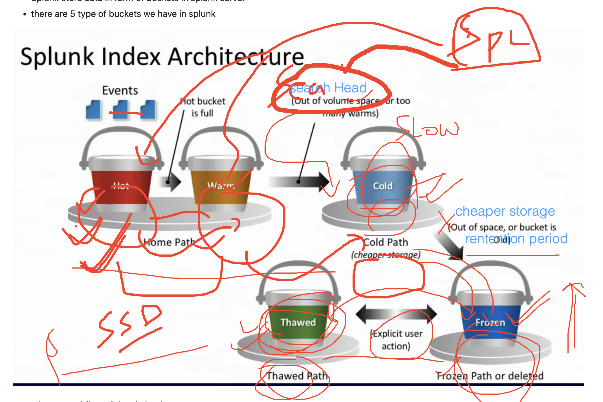

## plan for the day 


### splunk architecture phase 1


### understanding Splunk API and its connect port

```
/opt/splunk/bin/splunk show web-port
WARNING: Server Certificate Hostname Validation is disabled. Please see server.conf/[sslConfig]/cliVerifyServerName for details.
Web port: 8000
[root@jpmc-splunk-server ~]# 
[root@jpmc-splunk-server ~]# 
[root@jpmc-splunk-server ~]# /opt/splunk/bin/splunk show splunkd-port
WARNING: Server Certificate Hostname Validation is disabled. Please see server.conf/[sslConfig]/cliVerifyServerName for details.
Splunkd port: 8089
[root@jpmc-splunk-server ~]# 

```

### SPlunk for developers


### setup SPLUNK_HOME env for config purpose 

### SPLUNK_HOME as Installlation directory 

```
SPLUNK_HOME=/opt/splunkforwarder/
PATH=$PATH:$SPLUNK_HOME/bin
export PATH
```

## making SPLUNK_HOME persistent after reboot or disconnect

```
echo  "SPLUNK_HOME=/opt/splunkforwarder/"  >>~/.bashrc
echo  "PATH=$PATH:$SPLUNK_HOME/bin"  >>~/.bashrc 
echo  "export PATH"  >>~/.bashrc 
```

### SPlunk API 


### as a developer lets search it on splunk enterprse server 

```
curl  -k  -u admin:'kjhkh'   https://localhost:8089/services/search/jobs  -d search="search index=ashu-web"
<?xml version="1.0" encoding="UTF-8"?>
<response>
  <sid>1718949555.394</sid>
</response>

```

### using search id to search to result 

```
curl  -k  -u admin:'Redhat@098)(*'   "https://localhost:8089/services/search/jobs/1718949555.394/results?output=json"
```

### Understanding splunk Enterprise storage of indexed in server

```
[root@jpmc-splunk-server ~]# echo $SPLUNK_HOME
/opt/splunk/
[root@jpmc-splunk-server ~]# cd  /opt/splunk/
[root@jpmc-splunk-server splunk]# ls
README-splunk.txt  copyright.txt  lib               opt                splunk-9.2.1-78803f08aabb-linux-2.6-x86_64-manifest
bin                etc            license-eula.txt  quarantined_files  swidtag
cmake              include        openssl           share              var
[root@jpmc-splunk-server splunk]# cd  var/lib/splunk/
[root@jpmc-splunk-server splunk]# pwd
/opt/splunk/var/lib/splunk

```

## Understanding bucket concept in splunk storage 



### location of splunk data store

```
 
[root@jpmc-splunk-server ~]# cd /opt/splunk/var/lib/splunk/ashu-web/
[root@jpmc-splunk-server ashu-web]# ls
colddb  datamodel_summary  db  thaweddb
[root@jpmc-splunk-server ashu-web]# 
```

### splunk community to get more info 

[click_here](https://community.splunk.com/)

