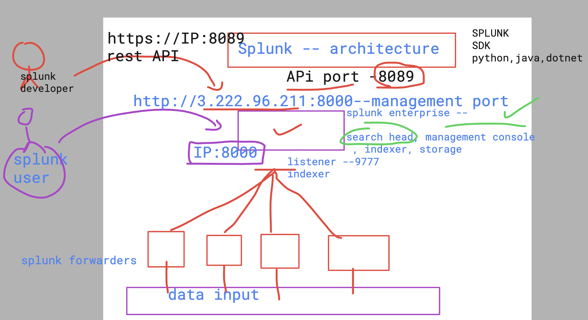

## plan for the day 


### splunk architecture phase 1


### understanding Splunk API and its connect port

```
/opt/splunk/bin/splunk show web-port
WARNING: Server Certificate Hostname Validation is disabled. Please see server.conf/[sslConfig]/cliVerifyServerName for details.
Web port: 8000
[root@jpmc-splunk-server ~]# 
[root@jpmc-splunk-server ~]# 
[root@jpmc-splunk-server ~]# /opt/splunk/bin/splunk show splunkd-port
WARNING: Server Certificate Hostname Validation is disabled. Please see server.conf/[sslConfig]/cliVerifyServerName for details.
Splunkd port: 8089
[root@jpmc-splunk-server ~]# 

```

### SPlunk for developers




### setup SPLUNK_HOME env for config purpose 

### SPLUNK_HOME as Installlation directory 

```
SPLUNK_HOME=/opt/splunkforwarder/
PATH=$PATH:$SPLUNK_HOME/bin
export PATH
```

## making SPLUNK_HOME persistent after reboot or disconnect

```
echo  "SPLUNK_HOME=/opt/splunkforwarder/"  >>~/.bashrc
echo  "PATH=$PATH:$SPLUNK_HOME/bin"  >>~/.bashrc 
echo  "export PATH"  >>~/.bashrc 
```

### SPlunk API 


### as a developer lets search it on splunk enterprse server 

```
curl  -k  -u admin:'kjhkh'   https://localhost:8089/services/search/jobs  -d search="search index=ashu-web"
<?xml version="1.0" encoding="UTF-8"?>
<response>
  <sid>1718949555.394</sid>
</response>

```

### using search id to search to result 

```
curl  -k  -u admin:'Redhat@098)(*'   "https://localhost:8089/services/search/jobs/1718949555.394/results?output=json"
```

### Understanding splunk Enterprise storage of indexed in server

```
[root@jpmc-splunk-server ~]# echo $SPLUNK_HOME
/opt/splunk/
[root@jpmc-splunk-server ~]# cd  /opt/splunk/
[root@jpmc-splunk-server splunk]# ls
README-splunk.txt  copyright.txt  lib               opt                splunk-9.2.1-78803f08aabb-linux-2.6-x86_64-manifest
bin                etc            license-eula.txt  quarantined_files  swidtag
cmake              include        openssl           share              var
[root@jpmc-splunk-server splunk]# cd  var/lib/splunk/
[root@jpmc-splunk-server splunk]# pwd
/opt/splunk/var/lib/splunk

```

## Understanding bucket concept in splunk storage 


### location of splunk data store

```
 
[root@jpmc-splunk-server ~]# cd /opt/splunk/var/lib/splunk/ashu-web/
[root@jpmc-splunk-server ashu-web]# ls
colddb  datamodel_summary  db  thaweddb
[root@jpmc-splunk-server ashu-web]# 
```

### splunk community to get more info 

[click_here](https://community.splunk.com/)


## Users in Splunk 


## splunk apps for aws cloud 


### splunk in k8s 

```
[root@jpmc-splunk-server ~]# kubectl   get nodes
NAME                                STATUS   ROLES   AGE   VERSION
aks-agentpool-30100587-vmss000000   Ready    agent   8h    v1.28.9
aks-agentpool-30100587-vmss000001   Ready    agent   8h    v1.28.9
[root@jpmc-splunk-server ~]# kubectl  get  ns
NAME              STATUS   AGE
default           Active   8h
kube-node-lease   Active   8h
kube-public       Active   8h
kube-system       Active   8h
[root@jpmc-splunk-server ~]# kubectl  get pods
No resources found in default namespace.
[root@jpmc-splunk-server ~]# 
[root@jpmc-splunk-server ~]# kubectl create  ns  ashu-splunk 
namespace/ashu-splunk created
[root@jpmc-splunk-server ~]# kubectl  get  ns
NAME              STATUS   AGE
ashu-splunk       Active   4s
default           Active   8h
kube-node-lease   Active   8h
kube-public       Active   8h
kube-system       Active   8h

```

### deploy app

```
[root@jpmc-splunk-server ~]# kubectl  create  deployment  ashu-webapp --image=nginx  --port 80 -n ashu-splunk
deployment.apps/ashu-webapp created
[root@jpmc-splunk-server ~]# kubectl  get  deploy
No resources found in default namespace.
[root@jpmc-splunk-server ~]# kubectl  get  deploy -n ashu-splunk 
NAME          READY   UP-TO-DATE   AVAILABLE   AGE
ashu-webapp   1/1     1            1           12s
[root@jpmc-splunk-server ~]# kubectl  get  pods -n ashu-splunk 
NAME                           READY   STATUS    RESTARTS   AGE
ashu-webapp-66bcb8b767-5pbqh   1/1     Running   0          18s
[root@jpmc-splunk-server ~]# kubectl  logs  ashu-webapp-66bcb8b767-5pbqh -n ashu-splunk 
/docker-entrypoint.sh: /docker-entrypoint.d/ is not empty, will attempt to perform configuration
/docker-entrypoint.sh: Looking for shell scripts in /docker-entrypoint.d/

```

### updating splunk yaml for k8s

```
apiVersion: apps/v1
kind: Deployment
metadata:
  creationTimestamp: null
  labels:
    app: splunk-server
  name: splunk-server
spec:
  replicas: 1
  selector:
    matchLabels:
      app: splunk-server
  strategy: {}
  template:
    metadata:
      creationTimestamp: null
      labels:
        app: splunk-server
    spec:
      containers:
      - image: splunk/splunk:latest
        name: splunk
        ports:
        - containerPort: 8000
        - containerPort: 8089
        env: 
        - name: SPLUNK_START_ARGS
          value: --accept-license
        - name: SPLUNK_PASSWORD
          value: Redhat@098
        resources: {}
status: {}

```


